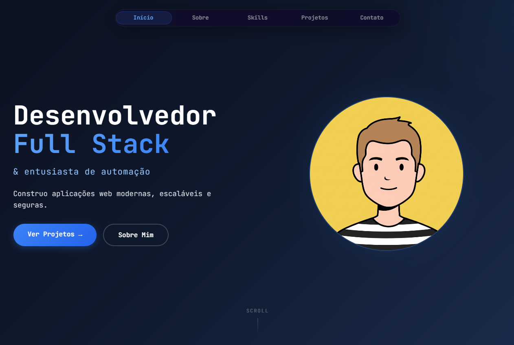
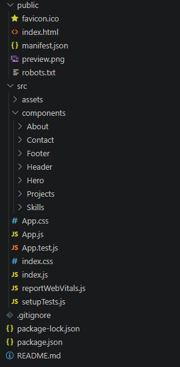

# 🚀 Meu Portfolio - Marcus Albuquerque

 
 

> Portfolio pessoal desenvolvido para apresentar meus projetos, habilidades e experiências como desenvolvedor Full Stack.

## 📋 Índice

- [Sobre o Projeto](#-sobre-o-projeto)
- [Tecnologias](#-tecnologias)
- [Estrutura do Projeto](#-estrutura-do-projeto)
- [Funcionalidades](#-funcionalidades)
- [Como Executar](#-como-executar)
- [Deploy](#-deploy)
- [Personalização](#-personalização)
- [Licença](#-licença)
- [Contato](#-contato)

## 🎯 Sobre o Projeto

Este é o meu portfolio profissional, onde compartilho minha trajetória como desenvolvedor Full Stack. O site foi construído com foco em design moderno e responsivo, experiência do usuário fluida, performance otimizada e acessibilidade.

## 🛠️ Tecnologias

React 18 - Biblioteca principal para construção da UI 
CSS Modules and Variables - Estilização isolada por componente com temas e cores globais

## 📁 Estrutura do Projeto

## ✨ Funcionalidades

Navbar fixa com indicador de seção ativa (efeito bolha) 
Scroll suave entre seções
Design responsivo para todos os dispositivos
Cards de projetos com expansão no hover
Animações de entrada nas seções
Formulário de contato com EmailJS

## 🚀 Como Executar

git clone https://github.com/marcus-albuquerque/portfolio.git 

npm install 
npm start

Para visualizar em outros dispositivos: npm start -- --host 0.0.0.0

## 🌐 Deploy

GitHub Pages: npm install --save-dev gh-pages. 
No package.json adicione "homepage": "https://seu-site.github.io/portfolio" e nos scripts: "predeploy": "npm run build", "deploy": "gh-pages -d build". 
Depois execute npm run deploy. 
Vercel: npm install -g vercel e depois vercel.

## 🎨 Personalização

Cores: Edite src/App.css e altere as variáveis CSS --bg-primary, --accent-primary, --accent-light, --text-primary e --text-secondary. Conteúdo: Edite os arrays em src/components/Projects/Projects.jsx para projetos, src/components/Skills/Skills.jsx para habilidades e o texto em src/components/About/About.jsx para a seção sobre.

## 📝 Licença

MIT License. Veja o arquivo LICENSE para mais detalhes.

## 📬 Contato

Email: barbosadealbuquerque@gmail.com 
LinkedIn: https://www.linkedin.com/in/marcus-albuquerque-b3766b214
GitHub: https://github.com/marcus-albuquerque

## ⭐ Agradecimentos

Feito com ❤️ por Marcus Albuquerque. Se gostou, deixe uma ⭐ no repositório!
